# Maratona-Java

Este é um repositorio para documentar meus estudos de Java usando o curso [[[Maratona Java Virado no Jiraya - YouTube](https://www.youtube.com/playlist?list=PL62G310vn6nFIsOCC0H-C2infYgwm8SWW)]] do DevDojo

## O que é o Java

Java é uma linguagem de programação, onde uma vez desenvolvido irá ser executado em qualquer lugar através da JVM (Java Virtual Machine)

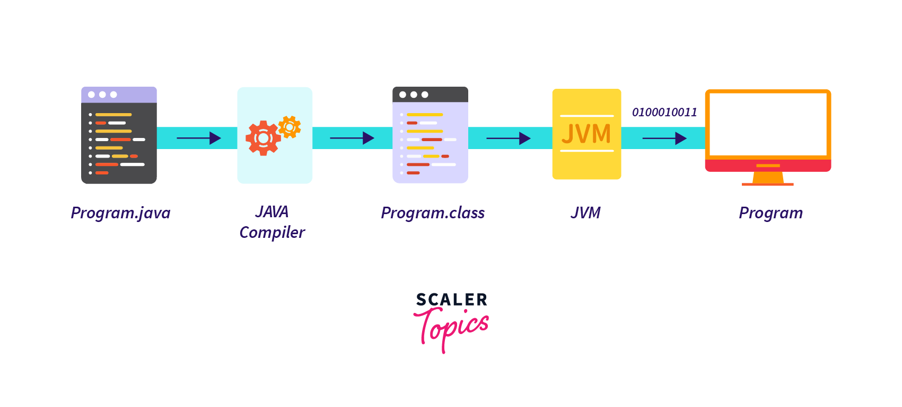
## Git Coventional Commits
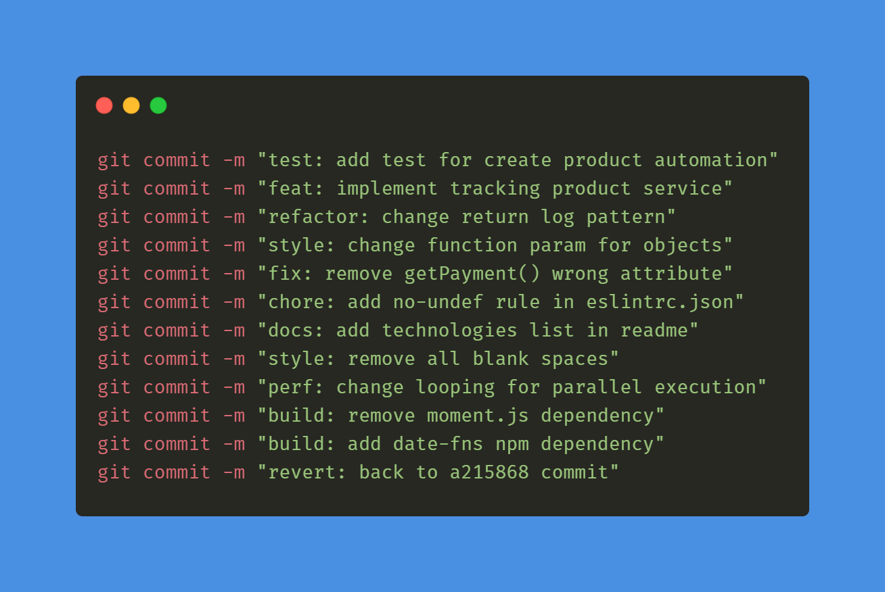
## Arrays

É uma estrutura de dados que armazena vários valores em uma unica variavel
### Formas de criar uma array de inteiros
`int[] nums = new int[3]{1, 2 , 3}`
`int[] nums = {1, 2, 3}`
`int[] nums = new int[]{1, 2 , 3}`

### For

O Loop For é utilizado para iterar partes do código sem a necessidade de reescrevê-las manualmente

#### Exemplo de for para escrever cada posição em um Array

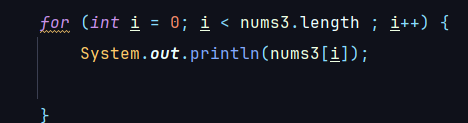

### Foreach

- Nao da pra acessar o indice do array
- Versao simplificada do for i
- Percorre cada uma das posicoes do array
- Nao precisa se preocupar com o tamanho do array

#### Exemplo de Foreach

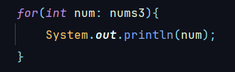

### Arrays Multidimensionais

Um Array multidimensional é uma estrutura de dados que armazena dados em múltiplas dimensões

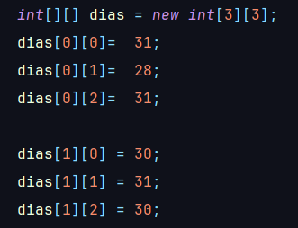

## Herança

É uma técnica de programação que permite criar classes com base em outras classes já existentes. A classe que herda é chamada de subclasse, enquanto a classe que é herdada é chamada de superclasse.
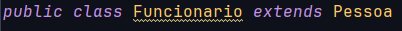
- Pessoa = superclasse
- Funcionario = subclasse

## Polimorfismo

Polimorfismo em Java é a capacidade de um objeto assumir diferentes formas. Isso significa que objetos de diferentes classes podem ser tratados de maneira uniforme
O polimorfismo é alcançado por meio de herança, interfaces e métodos virtuais.

## Errors e Exceptions

- Throwable significa lançado
- Quando é um Error é uma subclasse de Erro
- Um Exception é uma excessao
- 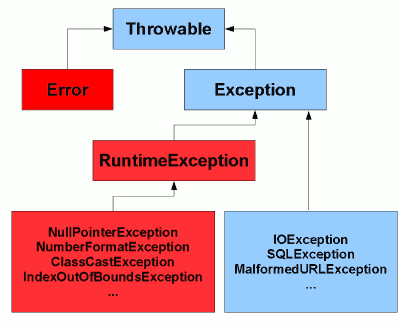
### Exceptions
Tem Exceptions checked e unchecked. Excessoes Checked sao filhas da classe Exception diretamente; As Uncheckeds  é a classe RuntimeException e suas filhas
### RuntimeException

É um excessão que vai ocorrer durante a execução
São excessões que voce desenvolveu errado ou nao fez uma tratativa

### Capturando Multiplas Exceções

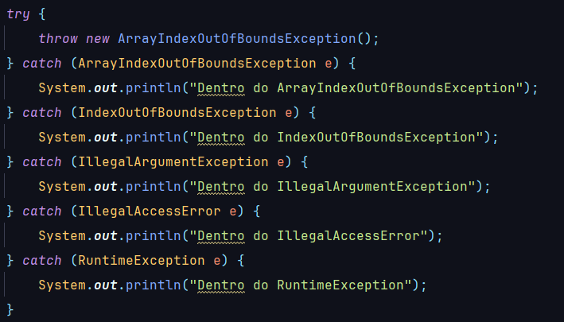
- O Java sempre ira escolher a que se adequar melhor aquela exceçao
- Colocar a exceçao mais generica por ultimo
- Não é comum ver tantos catch
- Funciona em filhas da classe Exception
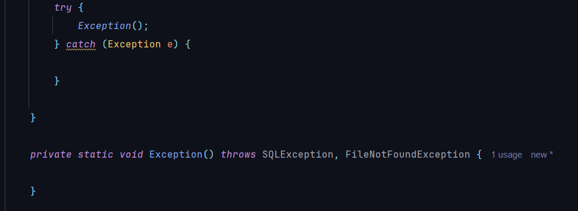

### Capturando Multiplas Exceções

- O Java sempre ira escolher a que se adequar melhor aquela exceçao
- Colocar a exceçao mais generica por ultimo
- Não é comum ver tantos catch
- Funciona em filhas da classe Exceptions

### Try with Resources

- So pode ser feita com objetos que implementa as interfaces `AutoCloseable` ou `Closeable`
- Sua Sintaxe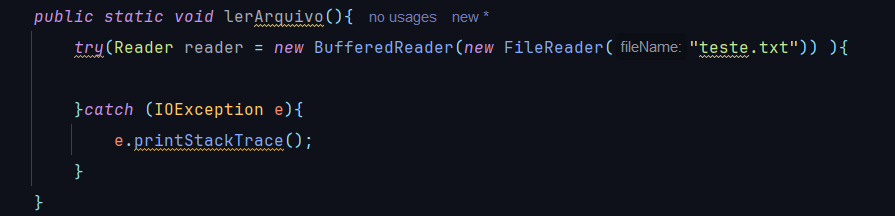
- Posso usar o try sem o catch e o finally mas eu tenho que jogar o Throws no metodo
- COM O CATCH 
- SEM O CATCH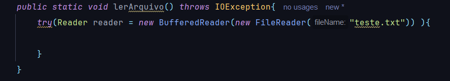
- Posso Criar quantas variaveis quiser contato que implementem o`Closeable`
- 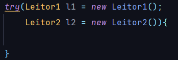
- O java fecha na ordem Inversa do que foi declarado
- 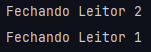

###  Exceção customizada

- Todas Excecoes terminam com Exception no final
- extends Exceptions(caso for checked) e RuntimeException(caso for unchecked)
- 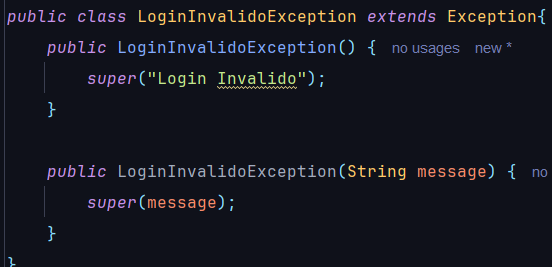

## Wrappers

Um dos motivos que o java criou os Wrapper foi para passar os valores por referencia e nao mais por valor.  A colecao de dados so trabalha com Wrappers. So usar wrapper quando for preciso

### Autoboxing

é um recurso da linguagem Java que permite a conversão automática de tipos primitivos de dados para objetos de classe wrapper

- Java converte automaticamente o tipo primitivo em Wrapper

### Unboxing

é uma operação de programação que converte um tipo de dado primitivo em um objeto de classe wrapper

- Converte o wrapper em tipo primitivo

