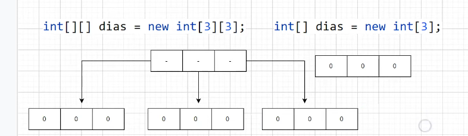

## *Oi, eu sou o José!*

### Git Coventional Commits

### Java Compiler

 
### Foreach

- Nao da pra acessar o indice do array
- Versao simplificada do for i
- Percorre cada uma das posicoes do array
- Nao precisa se preocupar com o tamanho do array
 
### Arrays Multidimensionais

- Eh um Array de Array
 